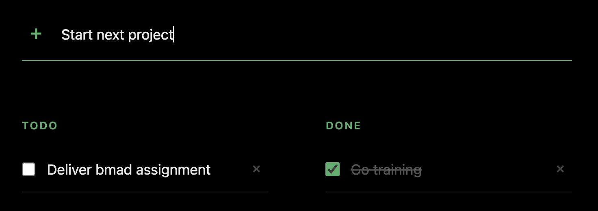

# todo-application-bmad



A personal todo board:
a FastAPI + SQLModel backend and a React + Vite client.

## Prerequisites

| Tool                             | Version | Needed for                                                                            |
|----------------------------------|---------|---------------------------------------------------------------------------------------|
| [uv](https://docs.astral.sh/uv/) | 0.12.x  | Backend dependencies and the pinned Python 3.13 (`make install`, `make test-backend`) |
| Node.js                          | 24 LTS  | Frontend and Playwright (`make install`, `make test-frontend`, `make dev`)            |
| GNU Make                         | 4.x     | Every entrypoint in this repo                                                         |
| Docker with Compose v2           | —       | `make up`, `make test-e2e`, `make ci`                                                 |
| [BMad Method](https://github.com/bmad-code-org/BMAD-METHOD)                | 6.11.0  | The agentic workflow this repo was built with: `npx bmad-method@6.11.0 install --tools claude-code,cursor --modules bmm --yes` |

`make install` fails without the first four; BMad is only needed to re-run the agentic workflow.

## Run

Run the built application in Docker:

```sh
make up
```

Open <http://localhost:8080>. Nginx serves the frontend and proxies `/api/*` to the backend.

## Develop

Run the backend and the frontend development servers:

```sh
make install
make test-backend
make test-frontend
make test-e2e
```

## Containers

One `docker-compose.yml` with two profiles:

- `dev` — built images, nginx on 8080 proxying `/api`, SQLite on the `todo-data` named volume.
- `test` — built images, nginx on 8080 proxying `/api`, SQLite on tmpfs. `make test-e2e`.

## Per-story QA

Every story closes with an agentic QA report in `qa/story-1.<M>.md` covering performance,
coverage, accessibility, security, and functional-in-real-Chrome, each with a verdict and
evidence. A story is not done without it, alongside a green `make ci`.

## Configuration

Every backend setting lives in `backend/app/config.py` and has a working local default. Copy
`.env.example` to `.env` **at the repository root** — that is the path `Settings` reads — to
override. `.env` is git-ignored; `.env.example` carries placeholders only.

## Success Criteria Scoreboard

| # | Deliverable                                                   | Reference                                                                              |
|---|---------------------------------------------------------------|----------------------------------------------------------------------------------------|
| 1 | All Phause 1–2 activities completed with documented learnings | `_bmad-output/planning-artifacts/`, `_bmad-output/implementation-artifacts/`           |
| 2 | Working application — all CRUD operations                     | `backend/app/`, `frontend/src/`; run with `make up`                                    |
| 3 | Minimum 70% meaningful code coverage                          | `make test-backend`, `make test-frontend`; `frontend/coverage/`                        |
| 4 | Minimum 5 passing Playwright E2E tests                        | `e2e/tests/`; run with `make test-e2e`                                                 |
| 5 | Runs successfully via `docker-compose up`                     | `docker-compose.yml` (profiles `dev`/`test`), `Makefile` target `up`                   |
| 6 | Zero critical WCAG violations                                 | Accessibility sections in `qa/story-1.<M>.md`                                          |
| 7 | README with setup instructions **and AI integration log**     | This file: [Run](#run), [Develop](#develop), [AI Integration Log](#ai-integration-log) |
| 8 | Framework comparison                                          | [Framework Comparison](#framework-comparison)                                          |

## AI Integration Log

### Agent Usage

**Which tasks were completed with AI assistance?**

- Creation of the PRD
- Creation of UX artifacts
- Creation of architectural documentation
- Creation of epics
- Sprint Planning
- Building out each story
- Sprint retrospective documentation

**Manual intervention:**

- Each step's orchestration (moving from one artifact or phase to the next, creating PRs, and managing
  iteration—especially for architecture and epics) was managed manually, rather than automatically chaining skills via
  the agent.
- Iterative refinement was especially needed for architecture and epic phases to better fit project needs.

**What prompts worked best?**

- PRD and UX generation tasks were handled smoothly with standard BMAD workflows.
- Architecture and epic creation required several prompt iterations. Architecture modeling required adjusting the
  agent/model to avoid overbuilding during the architecture phase (larger models tended to write too much code too
  early).
- Epic creation needed specific prompts to ensure test cases below the acceptance criteria were also defined. BMAD was
  not generating them reliably by default.
- The given `CLAUDE.md` has been used to reduce the tendency of claude to produce overly verbose docstrings and comments.

### MCP Server Usage

**Which MCP servers did you use? How did they help?**  
Primarily the Chrome MCP server was used.

- For backend checks, the agent was able to interact directly with the application.
- Chrome MCP significantly reduced manual effort by automating browser interactions and user actions.
- While Playwright was available and functional, Chrome MCP provided greater flexibility for automating, testing and
  iterating on complex user scenarios that required realistic browser behavior.

### Test Generation

**How did AI assist in generating test cases? What did it miss?**  
AI was primarily used during epic generation to create test cases based on acceptance criteria.
However, this process needed refinement:
few times the AI generated an excessive number of tests,
while at other times it omitted them completely.

### Debugging with AI

**Document cases where AI helped debug issues.**  
`make up` wasn't working, and the application realized by itself where the issue was.
It was a CORS issue and it has been fixed autonomously.

### Limitations Encountered

**What couldn't the AI do well? Where was human expertise critical?**  
First of all, AI struggled to run the BMAD process unsupervised.
Human oversight was required to orchestrate transitions between phases and to ensure a clean context at each step.

Note:
The process has been tried to run unsupervised using sub-agents.
However, the end results turned out to be worse than the supervised one:
- One time the loop started writing massive docstrings.
- Another time the loop generated a massive amount of tests - way more than the ones defined in the epics.md and way
  more than the complexity of the application required.

Secondly, Human intervention has been needed to define architecture, 
in particular, to select the right model based on the task:
a model had to be smart enough to abstract the spine ( Opus medium works, Composer 2.5 does not )
but not too capable for the use case ( Fable overengineered it ).

Lastly, Human intervention has been used to define test cases and story slicing.
Without customization, BMAD created a massive amount of tests with unpredictable slicing strategy. 
Horizontal slicing has been forced through the use of a custom prompts.

### Framework Comparison

The application has been developed only in BMAD.
Hence, framework comparison is not provided.