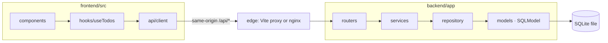
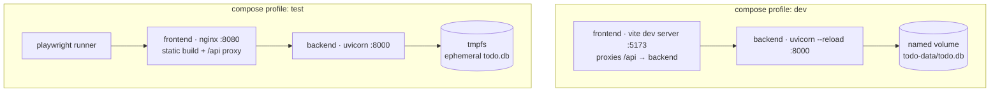
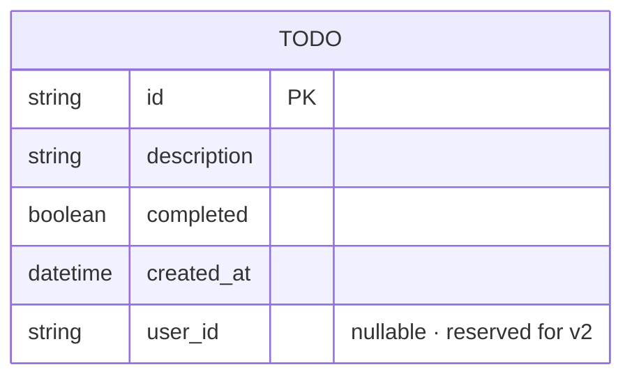

# Architecture Spine — Todo App

## Design Paradigm

**Layered monolith with a single same-origin API seam.** Two deployables, one contract, no service mesh and no shared library between them.

Backend layers map to modules under `backend/app/`: `routers/` (transport) → `services.py` (domain rules) → `repository.py` (persistence) → `models.py` (ORM tables). Frontend layers map to directories under `frontend/src/`: `components/` (presentational views) → `hooks/useTodos.ts` (all state and mutation orchestration) → `api/client.ts` (transport) . Dependencies point inward only; a layer never imports a layer above it, and siblings within a layer never import each other.



## Invariants & Rules

### AD-1 — Layered dependency direction

- **Binds:** all
- **Prevents:** routers running SQL, components issuing `fetch`, circular imports between sibling modules
- **Rule:** Imports flow strictly downward through the layers named in *Design Paradigm*. A module may import only from layers below it. Sibling modules within one layer must not import each other; shared behaviour moves down a layer.

### AD-2 — One contract authority, one mirror

- **Binds:** FR-7, all client/API integration work
- **Prevents:** two components inventing different `Todo` shapes; code drifting from `addendum.md`
- **Rule:** `backend/app/schemas.py` is the sole authority for request and response shapes; the OpenAPI document FastAPI derives from it is the published contract. The client mirrors it by hand in exactly one file, `frontend/src/api/types.ts`. No other frontend file may declare a type for an API payload, and no endpoint may return a shape not declared as a `response_model`.

### AD-3 — camelCase on the wire, snake_case in Python

- **Binds:** FR-1, FR-3, FR-5, FR-6, FR-7
- **Prevents:** half the endpoints emitting `created_at` and half `createdAt`
- **Rule:** Every schema in `schemas.py` inherits a shared base configured with a camelCase alias generator and `populate_by_name=True`. Python identifiers stay snake_case; JSON in both directions is camelCase. No per-field `alias=` overrides.

### AD-4 — One error envelope, produced centrally

- **Binds:** FR-1, FR-3, FR-4, FR-5, FR-6, FR-7
- **Prevents:** two error shapes on the wire; the client needing per-endpoint error parsing
- **Rule:** Every non-2xx response body is `{"error": "<CODE>", "message": "<user-facing text>"}` with `error` in `VALIDATION_ERROR | NOT_FOUND | INTERNAL_ERROR`. Bodies are produced only by exception handlers registered in `main.py`, keyed to an `AppError` hierarchy raised by services. Route handlers never construct an error response inline. FastAPI's defaults are remapped: `RequestValidationError` (422) → 400 `VALIDATION_ERROR`; any unhandled exception → 500 `INTERNAL_ERROR` with a generic message and the detail logged, never returned. The client renders the server's `message` verbatim and holds exactly one local fallback string, used only when there is no response at all (network failure); it never authors per-code copy of its own.

### AD-5 — Same-origin API, routed at the edge

- **Binds:** all client/API integration, container and environment work
- **Prevents:** CORS configuration diverging between environments; an API URL baked into the bundle at build time, which would make one image unusable across dev and test
- **Rule:** The client issues relative requests to `/api/*` only. No absolute API URL, and no API host env var, may appear in frontend source or build config. The edge routes `/api/*` to the backend: the Vite dev-server proxy under the `dev` profile, nginx inside the frontend image under `test`. The backend mounts every route under the `/api` prefix and registers no CORS middleware.

### AD-6 — One owner of todo state, one mutation path

- **Binds:** FR-1, FR-2, FR-3, FR-4, FR-5, FR-6
- **Prevents:** three divergent optimistic-update implementations; two components holding copies of server state
- **Rule:** `frontend/src/hooks/useTodos.ts` is the only holder of todo state and the only caller of `api/client.ts`. Every mutation follows one sequence: apply to local state optimistically → call the API → on failure revert **only the affected todo** to its pre-call value and surface a recoverable error. Whole-list snapshot-and-restore is forbidden, because it would silently undo a concurrent mutation. The hook exposes the list already partitioned as `active` and `completed`; no component re-filters or re-sorts. Components are presentational, receive todos and callbacks as props, and hold no state other than local input text.

### AD-7 — Server-generated ids; optimistic rows carry a temp key

- **Binds:** FR-3, FR-4, FR-7
- **Prevents:** duplicate rows after an optimistic create; client-invented ids reaching the database
- **Rule:** `id` is a server-generated UUIDv4 string. An optimistically inserted todo renders under a client-only temp key that is replaced by the server row on confirmation; the temp key is never sent to the API or persisted. Controls on a row still carrying a temp key are disabled until confirmation.

### AD-8 — Schema by ORM metadata, no migration tool

- **Binds:** FR-7, all persistence work
- **Prevents:** a migration tool or hand-written DDL entering the project; ad-hoc schema changes that silently break an existing database file
- **Rule:** The schema is created solely by `SQLModel.metadata.create_all()` on application startup — idempotent, additive-only. No migration framework and no raw `CREATE`/`ALTER` statements. Any change that is not the addition of a nullable column requires recreating the database file via `make db-reset`, and the change must be noted in the pull request description.

### AD-9 — All SQL in the repository; one session lifecycle

- **Binds:** FR-7, all persistence work
- **Prevents:** two session lifecycles, leaked connections, SQL scattered across routers
- **Rule:** Every SQL statement and every ORM query lives in `backend/app/repository.py`. Sessions are produced by a single FastAPI dependency that yields one `Session` per request and closes it. Routers and services never construct a `Session` or reference the engine. Repository functions `flush` and `refresh` so returned entities are fully populated for serialization, and never commit; the session dependency commits once if the request succeeded and rolls back if it raised.

### AD-10 — Validation authoritative on the server, mirrored from one constant

- **Binds:** FR-3, FR-7
- **Prevents:** client and server disagreeing on the description limit; a bypassed client permitting invalid rows
- **Rule:** `description` is trimmed and constrained to 1–200 characters in `schemas.py`; the server rejects violations with 400 `VALIDATION_ERROR` regardless of client behaviour. The client mirrors the bound from one exported constant in `frontend/src/api/types.ts` and rejects empty, whitespace-only, or over-length input before any network call (FR-3). No other literal `200` may appear in validation code on either side.

### AD-11 — Fixed test layers by responsibility

- **Binds:** all
- **Prevents:** the same behaviour covered three times while a layer goes untested; mock-heavy unit tests that prove nothing
- **Rule:** Each layer owns a distinct question and does not reach for another's.
  - **Backend integration (pytest + `httpx.ASGITransport`)** — every endpoint, including each error code, against a real per-test temporary SQLite file. The database is never mocked.
  - **Backend unit (pytest)** — only service rules that have branches worth isolating.
  - **Frontend component/hook (Vitest + Testing Library)** — rendering, interaction, and every optimistic-rollback path, against a stubbed `api/client` module. No network, no MSW.
  - **E2E (Playwright)** — whole user journeys only, against the compose `test` profile: create, complete, uncomplete, delete, empty state, API-failure error state. Accessibility is asserted here via `axe-core`.
  - Every E2E spec is order-independent and resets the state it touches through the API; no spec may depend on another spec's rows.
  - No test may start a live server except Playwright.

### AD-12 — One health contract

- **Binds:** container and environment work
- **Prevents:** each container defining its own health semantics; compose starting the client before the API can serve
- **Rule:** `GET /api/health` is the single liveness and readiness signal, returning `200 {"status": "ok", "database": "ok"}` after a trivial database round-trip and `503` with the same keys otherwise. The backend image's `HEALTHCHECK` and compose's `depends_on: {backend: {condition: service_healthy}}` both use it; the frontend image probes nginx's root. No other health or readiness endpoint exists.

### AD-13 — The Makefile is the only entrypoint

- **Binds:** all
- **Prevents:** CI and local runs drifting apart; a workflow step reimplementing a command
- **Rule:** Every developer and CI action is a target in the single root `Makefile` (`install`, `dev`, `test`, `test-backend`, `test-frontend`, `test-e2e`, `lint`, `coverage`, `db-reset`, `ci`). The GitHub Actions workflow runs on `pull_request` and invokes `make` targets only; it must contain no inline `pytest`, `npm test`, `docker compose`, or equivalent command. Anything a contributor must run has a target. Backend and frontend each gate independently at **≥70% line coverage**, enforced by the tool itself (`--cov-fail-under=70`, Vitest `coverage.thresholds.lines`); E2E runs contribute to neither number.

### AD-14 — Environments are compose profiles over one file

- **Binds:** container and environment work
- **Prevents:** per-environment compose files drifting; configuration read from scattered `os.environ` calls
- **Rule:** One `docker-compose.yml` with profiles `dev` (bind mounts, hot reload, SQLite on a named volume) and `test` (built images, ephemeral SQLite, the Playwright target). No `docker-compose.<env>.yml` variants. All backend configuration is read exactly once into a typed `Settings` object in `backend/app/config.py`; no module calls `os.environ` directly. Every setting has a working default for local `dev`, and no secret is committed.

### AD-15 — Auth-ready without auth

- **Binds:** FR-7
- **Prevents:** a v2 `userId` requiring a route redesign or a schema rebuild
- **Rule:** The `Todo` model carries a nullable `user_id` column, unset in v1 and absent from every v1 response schema. Route handlers take their scope from a single `current_scope` FastAPI dependency that returns the implicit v1 owner, so authentication is introduced by replacing that dependency rather than by editing handlers.

### AD-16 — Security baseline

- **Binds:** all
- **Prevents:** two builders disagreeing on the injection and XSS surfaces, and on what an error may reveal
- **Rule:** Data reaches the database only through SQLModel expressions; no SQL is built by string concatenation or f-string, and `text()` is not used. Rendering is React's default escaping only — `dangerouslySetInnerHTML` is banned, as is `innerHTML` and injecting user text into a URL or `style`. Responses never echo stack traces, SQL, file paths, or request bodies (AD-4). Containers run as a non-root user (AD-14's images), and no credential or token is committed; `.env` is git-ignored and `.env.example` carries placeholders only.

## Consistency Conventions

| Concern | Convention |
| --- | --- |
| Naming (entities, files, interfaces, events) | Single entity `Todo` everywhere — `Todo` (SQLModel table), `TodoCreate` / `TodoUpdate` / `TodoRead` (schemas), `Todo` (TS type). Python modules and files snake_case; React component files PascalCase matching their single default export; hooks `useX.ts`; test files `test_*.py` and `*.test.ts(x)` beside the code they cover. |
| Data & formats (ids, dates, error shapes, envelopes) | Ids: UUIDv4 strings (AD-7). Timestamps: UTC, ISO 8601 with offset, serialized as strings (AD-3). Success responses are the bare resource or a bare array — no envelope. Errors are `{error, message}` (AD-4). Ordering is always `createdAt` descending, applied in `repository.py`, never re-sorted in the client. |
| State & cross-cutting (mutation, errors, logging, config, auth) | Client state and mutations: AD-6. Server errors: services raise `AppError` subclasses; handlers translate (AD-4). Logging: stdlib `logging` to stdout as the container's only log sink, one logger per module, request errors logged with the exception, never with request bodies. Config: AD-14. Auth: AD-15. |
| Ports | Fixed everywhere they appear — backend `8000`, Vite dev server `5173`, nginx in the frontend image `8080`. `Makefile`, `vite.config.ts`, `docker-compose.yml`, the `Dockerfile`s, and `playwright.config.ts` use these and no others. |
| Styling | `DESIGN.md` tokens are declared once as CSS custom properties in `frontend/src/styles/tokens.css` and referenced only by `var(--token)`. No hard-coded hex values, no CSS-in-JS, no UI framework. |

## Stack

| Name | Version |
| --- | --- |
| Python | 3.13 |
| FastAPI | 0.141.1 |
| SQLModel | 0.0.39 |
| Pydantic | 2.13.4 |
| Uvicorn | 0.52.4 |
| pytest | 9.1.1 |
| httpx | 0.28.1 |
| Ruff | 0.16.5 |
| uv | 0.12.x |
| SQLite | 3.x (bundled with Python 3.13) |
| Node.js | 24 LTS |
| React | 19.2.8 |
| TypeScript | 7.0.2 |
| Vite | 8.2.2 |
| @vitejs/plugin-react | 6.1.1 |
| Vitest | 4.1.11 |
| @testing-library/react | 16.3.3 |
| Playwright | 1.62.1 |
| @axe-core/playwright | 4.13.0 |
| nginx | 1.30-alpine |
| Docker Compose | v2 |
| GitHub Actions | ubuntu-latest |

## Structural Seed

### Containers and environments



### Core entity



### Source tree

```text
todo-app-nearform/
  Makefile                     # AD-13 · the only entrypoint
  docker-compose.yml           # AD-14 · profiles dev | test
  .env.example
  .github/workflows/ci.yml     # pull_request → make ci
  backend/
    Dockerfile                 # multi-stage, non-root, HEALTHCHECK → /api/health
    pyproject.toml
    app/
      main.py                  # app factory, exception handlers (AD-4), /api mount
      config.py                # Settings (AD-14)
      db.py                    # engine, create_all (AD-8), session dependency (AD-9)
      models.py                # SQLModel Todo table
      schemas.py               # contract authority (AD-2, AD-3, AD-10)
      errors.py                # AppError hierarchy
      repository.py            # all SQL (AD-9)
      services.py              # domain rules
      deps.py                  # current_scope (AD-15)
      routers/
        todos.py
        health.py              # AD-12
    tests/
      test_todos_api.py
      test_health.py
      conftest.py
  frontend/
    Dockerfile                 # multi-stage build → nginx, non-root, HEALTHCHECK
    nginx.conf                 # serves build, proxies /api (AD-5)
    package.json
    vite.config.ts             # dev proxy /api (AD-5)
    src/
      api/
        types.ts               # the single mirror (AD-2, AD-10)
        client.ts
      hooks/
        useTodos.ts            # AD-6
      components/
        AddBar.tsx
        TodoRow.tsx
        TodoColumn.tsx
        ErrorBanner.tsx
      styles/tokens.css        # DESIGN.md tokens
      App.tsx
      main.tsx
  e2e/
    playwright.config.ts
    tests/
      journeys.spec.ts
      accessibility.spec.ts
```

## Capability → Architecture Map

| Capability / Area | Lives in | Governed by |
| --- | --- | --- |
| FR-1 Display list on load (loading / empty / error states) | `hooks/useTodos.ts`, `App.tsx`, `routers/todos.py` | AD-2, AD-4, AD-6 |
| FR-2 Distinguish active vs completed | `components/TodoColumn.tsx`, `components/TodoRow.tsx`, `styles/tokens.css` | AD-6, Styling convention |
| FR-3 Add todo with description | `components/AddBar.tsx`, `schemas.py`, `services.py` | AD-6, AD-10 |
| FR-4 Optimistic create with rollback | `hooks/useTodos.ts` | AD-6, AD-7 |
| FR-5 Toggle completion | `hooks/useTodos.ts`, `routers/todos.py`, `repository.py` | AD-6, AD-9 |
| FR-6 Delete todo | `hooks/useTodos.ts`, `routers/todos.py`, `repository.py` | AD-6, AD-9 |
| FR-7 Persist todos via CRUD API | `routers/todos.py`, `services.py`, `repository.py`, `models.py` | AD-2, AD-3, AD-4, AD-8, AD-9, AD-15 |
| Health, containers, environments | `routers/health.py`, `Dockerfile`s, `docker-compose.yml` | AD-5, AD-12, AD-14 |
| Test infrastructure and CI | `backend/tests/`, `frontend/src/**/*.test.tsx`, `e2e/`, `Makefile`, `ci.yml` | AD-11, AD-13 |
| Security baseline (NFR §8) | `repository.py`, `schemas.py`, `components/`, `Dockerfile`s | AD-4, AD-10, AD-16 |

## Deferred

- **Authentication and multi-user isolation** — explicitly out of scope for v1; AD-15 reserves the seam, so the decision costs nothing to postpone.
- **Cloud deployment, TLS termination, and a production compose profile** — the PRD scopes v1 to local deployment. Adding a `prod` profile is additive under AD-14 and needs a hosting target first.
- **Database engine beyond SQLite** — a v2 concern that arrives with multi-user; AD-9 confines the blast radius to `repository.py`.
- **Concurrency control on toggle** — last-write-wins is accepted by the PRD for a single implicit user.
- **Pagination, filtering, and sorting controls** — PRD non-goals; ordering is fixed by convention, so no unit can diverge.
- **Structured/JSON logging, metrics, and tracing** — stdout logging satisfies the brief's `docker compose logs` requirement; a format decision needs a log sink that does not exist yet.
- **Rate limiting and request size limits** — no public exposure in v1; revisit with the first non-local deployment.
- **Frontend error-reporting service and a client-side router** — a single surface with no routes has nothing to route or report to.
